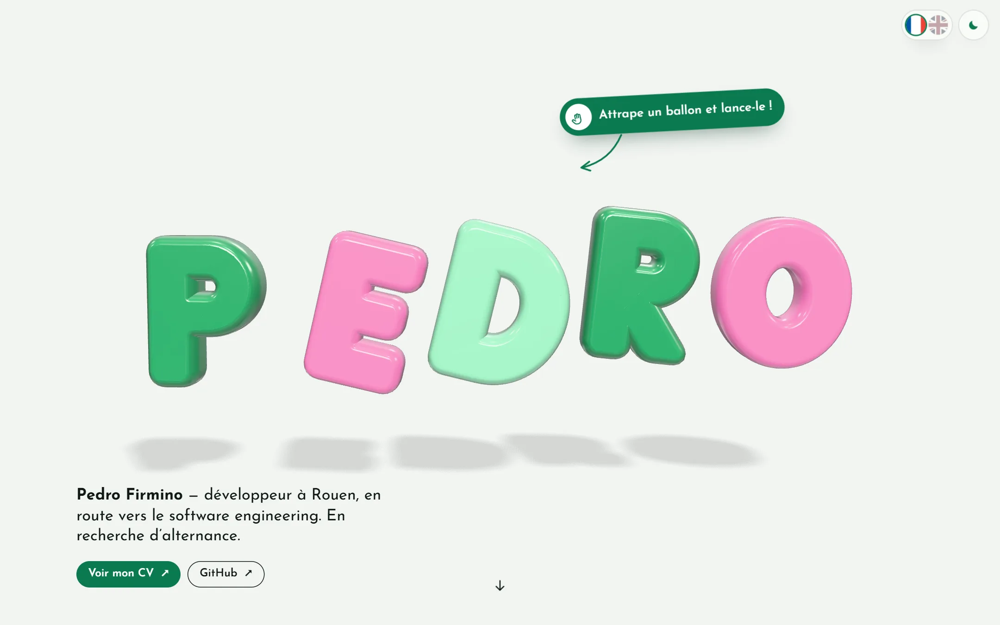

# Pedro Firmino · Portfolio

My personal portfolio, built from scratch with TypeScript, Three.js and Vite. No UI framework.

**Live:** [pedrofrmndss.netlify.app](https://pedrofrmndss.netlify.app)



## What's inside

- **Inflatable 3D letters.** The PEDRO letters are drawn in code, point by point, then extruded with a thick bevel. Smoothing the normals between the face and the bevel gives the puffy look. No 3D font, no imported model.
- **Balloon physics.** Each letter is a physical body: a soft spring pulls it back to its place, low damping lets it wobble. You can grab a letter, throw it, and the letters bump into each other.
- **A light version on phones.** Three.js is never loaded on touch screens. On desktop it is loaded separately, after the rest of the page.
- **One page per project, generated at build time.** All the content lives in one typed data file. A small Vite plugin writes a real HTML page for each project, with its own title and description.
- **Two languages without a library.** The English version is laid over the French one, field by field. Anything not translated stays in French.
- **Back where you left off.** Coming back from a project page restores the exact scroll position on the home page, even if the page height changed.
- **Accessibility.** Keyboard navigation, visible focus, screen reader labels, and every animation turned off when the system asks for reduced motion.

## Tech

TypeScript, Three.js, GSAP and ScrollTrigger, Lenis, Vite. Deployed on Netlify.

## Run it locally

```bash
npm install
npm run dev
```

`npm run build` checks the types and builds the site into `dist/`.

## Project structure

```
src/
  data.ts            all the content, typed (French)
  data.en.ts         the English version, laid over the French one
  i18n.ts            current language and the t(fr, en) helper
  hero/              the 3D letters: shapes, scene and physics
  pages/             entry points for the home page and the project pages
  ui/                carousel, skills, code window, journey timeline
  core/              navigation, smooth scroll, reveal animations
  styles/main.css    design tokens, layout, light and dark themes
vite.config.ts       plugin that generates /projets/<id>/
```

## Credits

- Skill logos: [Devicon](https://devicon.dev) (MIT).
- Project cover photos: [Unsplash](https://unsplash.com) (Unsplash License). Photographers are credited in `src/data.ts`.
- Fonts: Bagel Fat One, Josefin Sans, Gochi Hand and Ubuntu Mono, from Google Fonts.

## Contact

[LinkedIn](https://www.linkedin.com/in/pedro-firmino-764508344/) · [GitHub](https://github.com/Pedrofrmndss)
